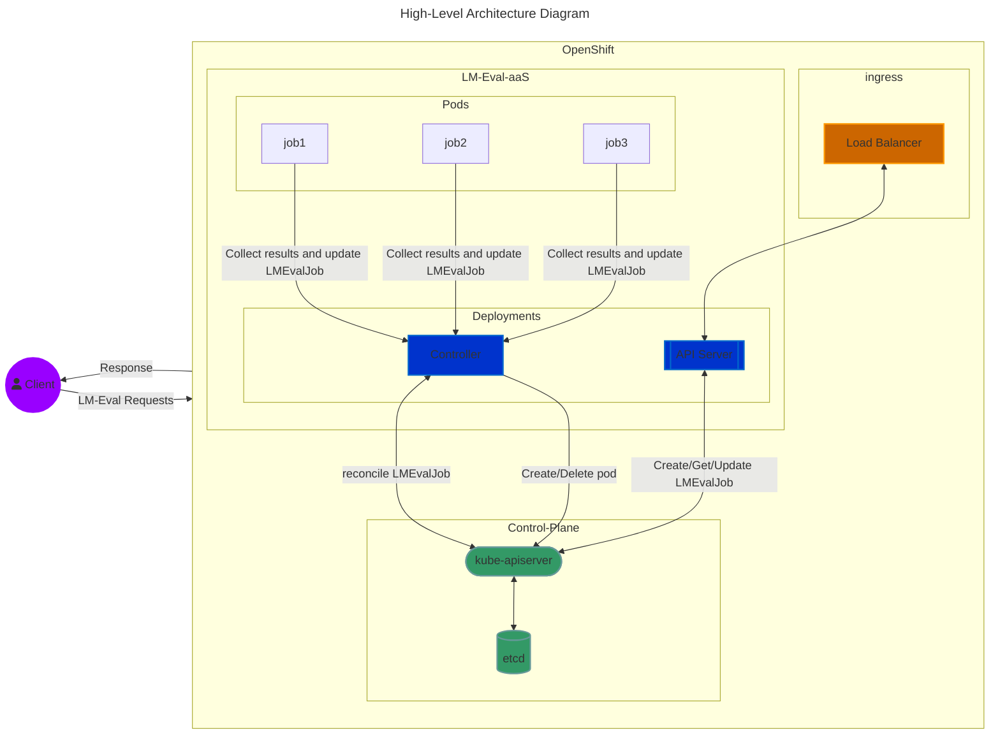
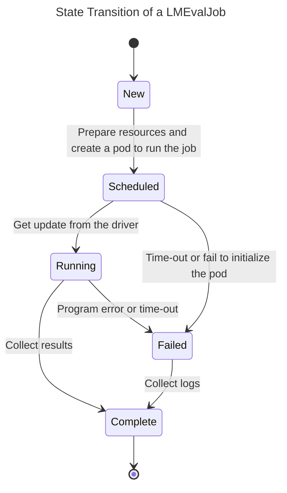

# The Backend of LM-Eval-aaS #

The backend of LM-Eval-aaS provides the functionalities to handle the LM-Eval tasks
received from the API server and the details of the APIs can be found [here](../api/OpenAPI.yaml).
Currently, the backend can be deployed on the OpenShift/Kubernetes cluster and here are the key components:
- CustomResourceDefinition: Kind: `LMEvalJob`, Group: `foundation-model-stack.github.com.github.com`, Version: `v1beta1`
  This CRD carries the parameters of `submit_job` API and the status fields that are used by
  the controller to populate the job status and results.
- Controller: The controller reconciles `LMEvalJob` custom resources, creates corresponding Pods to run the lm-eval
  tasks, collects results when lm-eval jobs finish, and cancels the jobs when a `cancel_job` request is received. The
  controller also registers the admission webhooks of the `LMEvalJob` as the validator. The controller also serves
  gRPC API to update LMEvalJob's status. 
- Driver: A lightweight program to wrap the `lm-eval + unitxt`, run the lm-eval program, collect outputs and results,
  and update `LMEvalJob` status via the gRPC API in the controller. When the controller creates a pod to run the
  LMEvalJob, An init container is used to copy the driver binary into the main container. In the main container,
  the `Commands` are the driver and the original job's commands are converted into the `Args`.

## High-Level Architecture ##

## State Transition of a LMEvalJob

## Design

### Cusotm Resource Definition: LMEvalJob

Since the LM-Eval-aaS is a wrapper of the `lm-evaluation-harness + unitxt`, most of the data fields of the `LMEvalJob`
CRD can be mapped to the arguments of the lm-evaluation-harness. The [data struct](../api/v1beta1/evaljob_types.go) for
the LMEvalJob contains the following fields:

| LMEvalJob | Data Type | Optional |Parameter in lm-evaluation-harness | Description
| --- | --- | --- | --- | -- |
| Model | string | | --model | Model type or model provider |
| ModelArgs | [][Arg](../api/v1beta1/evaljob_types.go#L57-L60) | X | --model_args | Parameters to the selected model type or model provider. The data is converted to s string in this format and pass to lm-evaluation-harness: `arg1=val1,arg2=val2` |
| Tasks | []string |  | --tasks | Specify the tasks or task groups to evaluate |
| NumFewShot | int | X | num_fewshot | Sets the number of few-shot examples to place in context |
| Limit | string | X | --limit | Limit the number of documents to evaluate. Use integer string to specify an explicit number or a float between 0.0 and 1.0 in the string format for a specific portion |
| LogSamples | boolean | X | --log_samples | If this flag is passed, then the model's outputs, and the text fed into the model, will be saved at per-document granularity. |

The `status` subresource of the `LMEvalJob` custom resources contains the following information:
- `PodName`: the controller uses this field to store the name of the Pod that runs the lm-eval job.
- `State`: records the lm-eval job's status in this field. Possible values are:
  - `New`: means the lm-eval job is created and not processed by the controller yet
  - `Scheduled`: means a Pod is created by the controller for the job
  - `Running`: the driver in the Pod reports the job is running.
  - `Complete`: the job finishes or fails and the driver reports the job is complete
  - `Canceled`: means the job cancellation is initiated, the controller is going to cancel the job
     and change to Complete state when the job is canceled
- `Reason`: the information about the current state:
   - `NoReason`: No information about the current state
   - `Succeeded`: The job finished successfully
   - `Failed`: The job fails
   - `Cancelled`: the job is canceled
- `Message`: more details about the final state
- `LastScheduleTime`: the time the job's Pod is scheduled
- `CompleteTime`: the time the job's state becomes `Complete`
- `Results`: store the lm-eval job's results. Since the etcd has the size limitation currently,
  the results JSON file shall not hit the limitation (including the CR's other field). We may move
  the results to another data store in the future.

### The Controller

The controller is responsible for monitoring the `LMEvalJob` CRs and reconciling the corresponding resources -
the Pods in the current design. If a more complex/flexible job scheduling is needed, the controller will watch
other resources instead. The skeleton of the controller is generated by the [kubebuilder](https://book.kubebuilder.io/).
To eliminate the reconciliation triggered by the `LMEvalJob` CRs and Pods, the controller doesn't register the
`Deletion` events of the `LMEvalJob` CRs and only monitors the `Deletion` events of the corresponding Pods.
Here are the details of how the controller handles an `LMEvalJob` CR:

- Admission Webhooks: The controller implements the admission webhooks for the `LMEvalJob` specifically for
  validation. Currently, it only validates the `Limit` field which should be either an Integer or Float string
- ConfigMap: The controller uses a ConfigMap for its settings, including:
  - driver-image: This is used in the init container which contains the driver binary.
  - pod-image: This is the image for the main container of the job's Pod. It contains the
    `lm-evaluation-harness + unitxt` Python packages and is used to run the lm-eval jobs.
  - pod-checking-interval: The container checks the scheduled Pods with a fixed interval from this value.
    It uses the `time.Duration` [format](https://pkg.go.dev/time#ParseDuration). The default value is `10s`.
  - image-pull-policy: This is used for the ImagePullPolicy of the Pod. The Pods created by the controller
    use this config value as the ImagePullPolicy. The default value is `Always`
- Arguments: The controller supports the following command line arguments:
  - `--namespace`: Where you deploy the controller, by default the namespace of the controller deployment
    is used
  - `--configmap`: Specify the ConfigMap's name that stores the config settings 
  - kubebuilder's built-in arguments: `--metrics-bind-address`, `--health-probe-bind-address`, `--leader-elect`
    , `--metrics-secure`, and `--enable-http2`
- Finalizer: The controller put itself as one of the `LMEvalJob`'s finalizers, using
  `lm-eval-job.foundation-model-stack.github.com.github.com/finalizer`. This makes sure the controller
  reconciles the LMEvalJob CRs before deletion.
- Workflow: The normal flow of a `LMEvalJob` CR is:
  - New: Update CR's finalizer and insert the controller's finalizer ID.
  - New (Reconcile for the previous update of the finalizer):  prepare and create a Pod for the job meanwhile
    recording down the time and Pod name into the `LMEvalJob` CR, and transiting to the `Scheduled` state.
    The Pod contains the OwnerReference pointing back to the LMEvalJob CR as well.
  - Scheduled: Periodically check the Pod and transit the state to Complete if the Pod fails to start and
    store the error message in the status's `Message` field.
    
    TODO: Need a timeout mechanism here to stop the check and mark the job as failed.

  - Running: Similar to the `Scheduled` state, check the Pod's status to see if the job fails or not.
  - Complete: Records the time into the status
  - Canceled: Receive the cancel request and revoke the Pod for the LMEvalJob, then transit to the
    `Complete` state when the Pod is deleted.

The working flow on the controller side is quite easy because some of the works are off-loaded to the driver.
Let's get to the driver and complete the whole picture.

### The Driver

The driver is a light-weight program that wraps the `lm-evalulation-harness + unitxt` and actively updates
job statuses through the gRPC API the controller provides, so the controller doesn't have to keep monitoring
the Pod CRs and doing the reconciliation because of a bunch of Pod's changes. Here is how the driver plays
the role in the LMEvalJob workflow:

- Scheduled: This is the state that a Pod created for the job, the driver binary is copied to the main container,
  and is launched to run the lm-eval job. Once the driver is ready to spawn a sub-process to run the
  lm-eval job, it transits the state into the Running state. Otherwise, it marks the job as Complete with
  failure information.
- Running: Once the job is done, the driver collects the results, invokes gRPC API to update the job's status and result,
  and updates its status to the Complete state.

## Code Structure

- [api](../api): contains the REST APIs definition and go pkg for the LMEValJOb's data struct, group, kind information
- [backend](../backend/): containers the controller and driver's implementation
  - [controller](../backend/controller/): the controller's code
  - [driver](../backend/driver/): the driver's code
- [cmd](../cmd/): main programs for the controller and driver
- [config](../config/): manifests for the controller's deployment
- [docker](../docker/): Dockerfile for building controller, driver, and `lm-eval + unitxt` images
