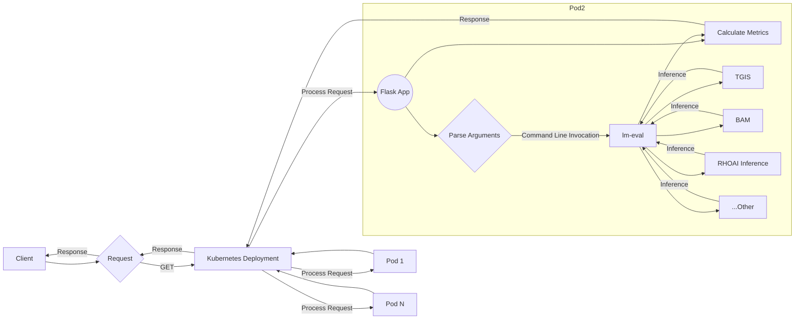
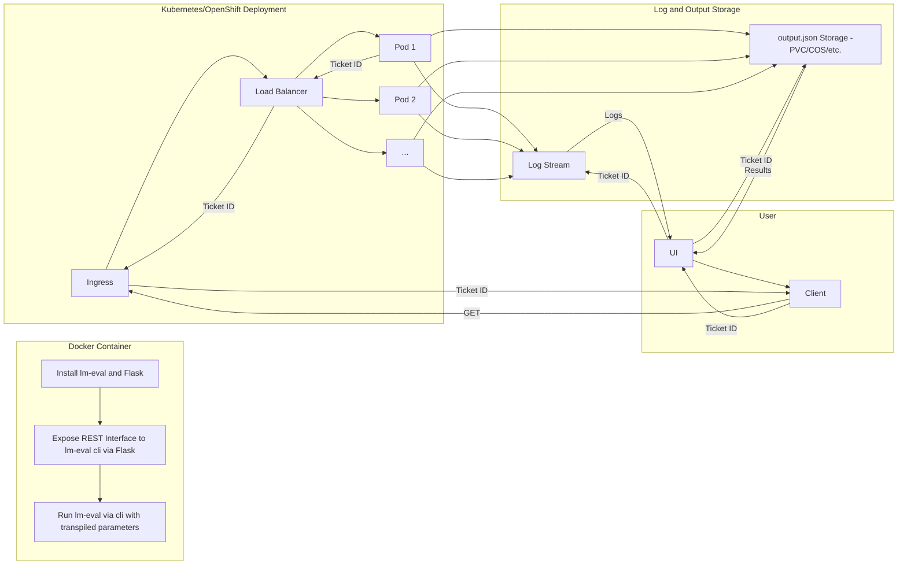

# Kubernetes Wrapper for LM-Evaluation-Harness (lm-eval)

This project is a Kubernetes wrapper for the `lm-evaluation-harness`, aimed at 
facilitating the deployment and management of language model evaluations within 
Kubernetes/OpenShift environments. It's currently under active development and 
resides in this repository as a work-in-progress.

## Overview

The Kubernetes wrapper for `lm-evaluation-harness` (hereafter referred to as 
`lm-eval-aas`) extends the basic functionality of the original tool by 
integrating with Kubernetes APIs for state management and deploying as a Custom 
Resource (CR). This integration allows for more scalable and flexible deployment
options suitable for various computational and storage needs.

## Architecture Decision Record (ADR)

We have an ADR available for this project, which outlines the rationale behind 
major architectural decisions. You can view and comment on the ADR here: 
[View ADR](https://ibm.ent.box.com/file/1506388662733?s=ncewoy3bp2hb5wdbyge1rmb60sds3lkx).

## Key Features (None Currently Implemented)

- **Kubernetes API Integration**: Unlike previous demonstrations that managed  
state with a NoSQL database or local disk storage, `lm-eval-aas` uses the 
Kubernetes API for state management, enhancing the robustness and scalability of
the application.

- **Deployment as a Custom Resource (CR)**: The tool is designed to be deployed 
as a CR within a Kubernetes cluster, allowing for better integration with 
existing cluster management practices and tools.

- **Support for Persistent Volume Claims (PVCs)**: `lm-eval-aas` can mount PVCs 
to access custom data sets. This is particularly useful for evaluations that 
require large or specific data sets not typically stored within the cluster, and 
for customers with sentative data handling requirements.

## Development Status

This project is currently in a work-in-progress state. Contributions and feedback are welcome. Please refer to the issue tracker in this repository to report bugs or suggest enhancements.

## Getting Started

As the project is still under development, detailed instructions on deploying 
and using `lm-eval-aas` will be provided as the features are finalized and the 
project reaches a stable release.

# Diagrams

#### Mermaid chart links:

### Flow Diagram

### Architecture Diagram

